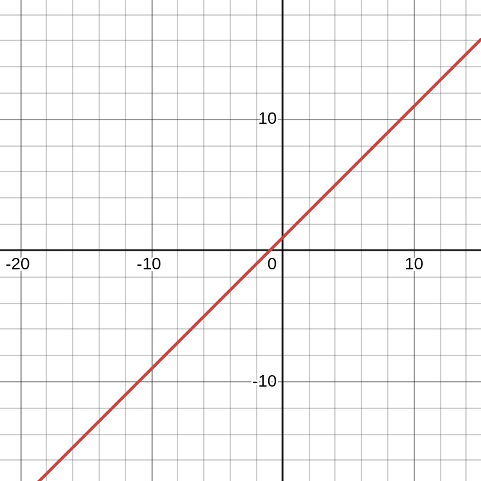
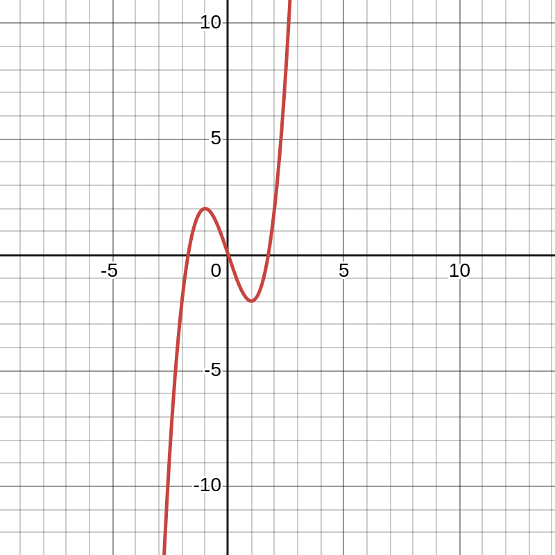
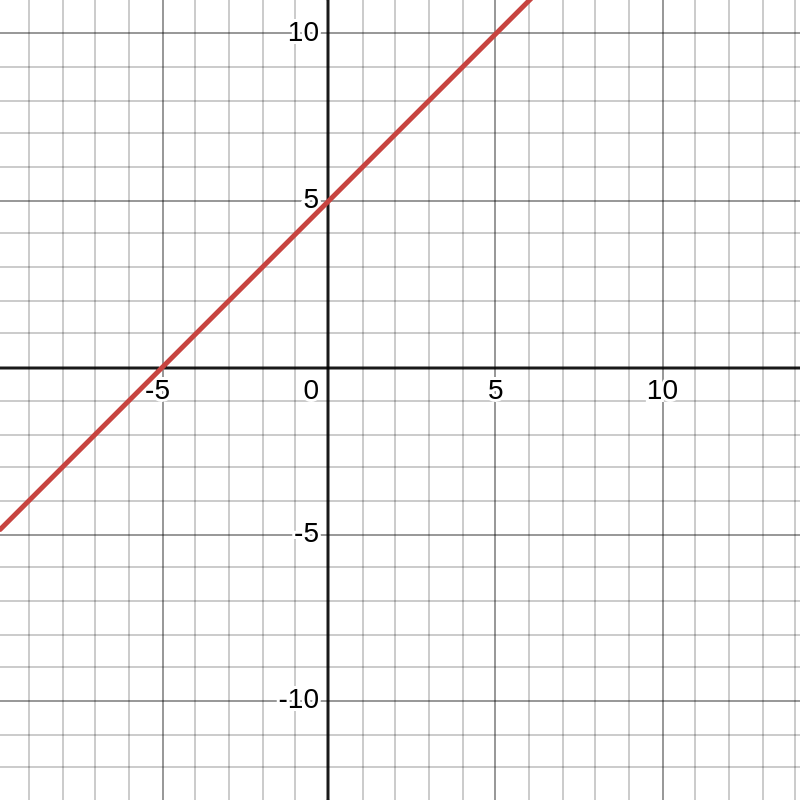

## Function
Note, all the categories below are valid functions.
To test if a mapping is a valid function we the vertical line test.
Every single input must have one output. A function is still valid if multiple 
inputs take on the same output, in this case the horizontal line test would fail(not injective).

## Injective

A function $( f: A \to B )$ is injective if

$$
(a \neq b) \Rightarrow f(a) \neq f(b).
$$

$$ \textcolor{blue}{\textit{(If the inputs are different, the outputs are different)}}$$ 

OR

$$
(a = b) \Rightarrow f(a) = f(b).
$$

$$ \textcolor{blue}{\textit{(If the outputs are the same, the inputs are the same)}} $$

where, $a, b \in A$

In other words, a function $f : A \to B$ is called $\textbf{injective}$ (or $\textbf{one-to-one}$) if each element of the $\textit{codomain}$ has at most one element of the domain that maps to it.

A function with this property is called an $\textbf{injection}$.

### Example 1
A linear injection:

### Theorem 1

Let $g: A \to B$ and $f: B \to A$ be $\textbf{injective functions}$. Then $f \circ g$ is injective.
This composition maps from $\textit{A}$ to $\textit{C}$, such that: $f \circ g: A \to C$.
$x, y \in A, x \neq y$. This must also imply that $f \circ g$(x) $\neq f \circ g(y)$.
Since we know - we evaluate $g$ first, and we know it's $\textbf{injective}$:
$g(x)$ $\neq g(y)$ and $g(x), g(y) \in B$
We also know that $f$ is injective so that
$f(g(x)) \neq f(g(y))$ $\implies$ $f\circ g(x) \neq f\circ g(y)$.
Thus $f\circ g$ is injective.

### Theorem 2

#### Agda proof here

## Surjective
A function  $( f: A \to B )$ is surjective(onto) if each element of the $\textbf{codomain}$ is "covered"
by at least one element of the domain. A function with this property is called a $\textbf{surjection}$.

$b \in B, a \in A$ such that $f(a) = b$

$$ \textcolor{blue}{\textit{(For every possible output, there's at least one possible input that produces it)}} $$

### Theorem 1
Let $g: A \to B$ and $f: B \to C$ be surjective functions. Then $f \circ g$ is surjective.
$y, \in C$.
Since f is surjective $x \in B, f(x) = y$.
Since g is surjective $x' \in A, g(x') = x$.
$f \circ g$(x') = $f(g(x'))$ = f(x) = y
$\implies$ 
$f \circ g$(x') = y

### Theorem 2

### Example 1

## Bijective
A function that assosciates each element of the codomain with a unique element of the domain
is called $\textbf{bijective}$. Such a function is a $\textit{bijection}$.
Formally, a bijection is a function that is both textbf{injective}$ and textbf{surjective}$.
Bijections are sometimes called one-to-one correspondences.

To have an inverse(invertible) a function must be bijective.

### Theorem 1
Suppose that $f: A \to B$ and $g: B \to C$ are bijections.
The composition of these function is a bijection as well.

- Since both $\textit{f}$ and $\textit{g}$ are injective, we know that $g\circ f$ is injective.
- Since both $\textit{f}$ and $\textit{g}$ are surjective, we know that $g\circ f$ is surjective.
- Therefore, $g\circ f$ is a bijection.

### Example 1

#### Are all linear functions bijective?

If it is not zero, yes.

#### Link to next chapter here.